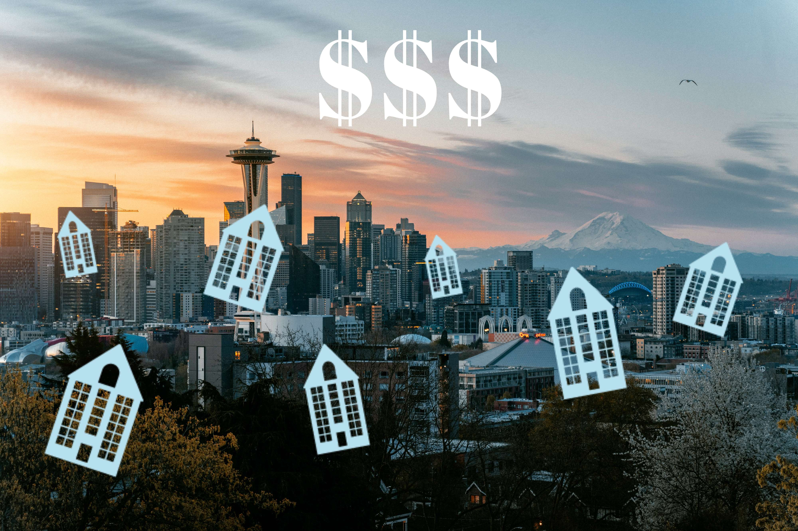
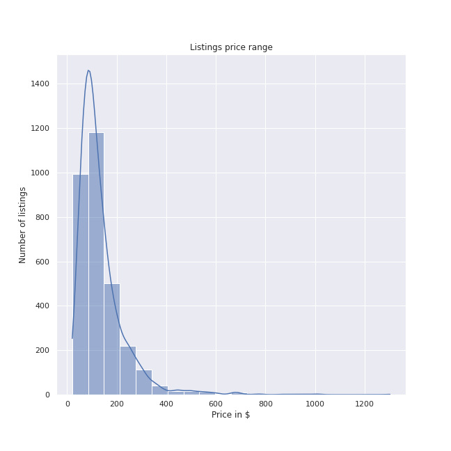
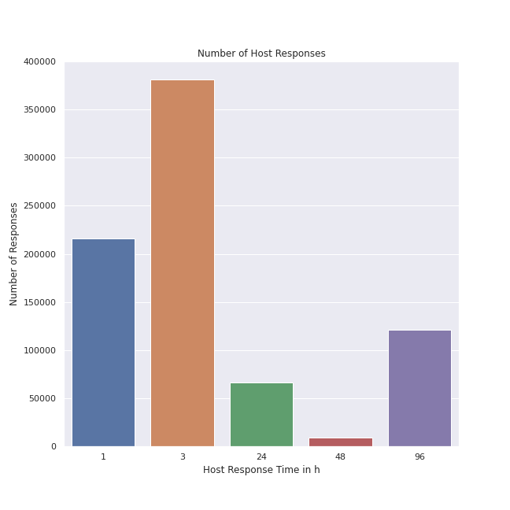

# You want to rent out your apartment in Seattle through AirBnb? You have to pay attention to this.

Seattle is the largest city in the northwest of the USA. With a correspondingly large number of people looking to visit this beautiful part of the country, there is a high demand for short-term apartment rentals. This is a perfect opportunity for anyone who has a spare apartment or room to put some money in their coffers.

## The bottom line is money

Prices of listings offered through AirBnB in Seattle range from $10 to $1650. On average, an apartment on AirBnb costs the visitor around $140 per day. No idea for what reason to offer your apartment for $10 (maybe you have a good heart) or who pays over $1500 a day for an apartment (too much money, anyone?) - most are hawking their apartment in a range that anyone can afford. Between $50 and $200 is the usual range, and you should only break that if there's a valid reason.

## Answer your vistor's requests

Who is not happy when you write a message to someone and receive a response within a very short time? Especially when you put your trust in someone and want to spend the night in their apartment, it is important to receive a quick and uncomplicated answer. 

This is also reflected in AirBnb's figures. Most hosts respond within 3 hours. Some take more than a day, which is absolutely fine. After all, you're not always on your cell phone. But if the response time exceeds a few days, you should think about earning your money somewhere else. 

## How to set the price?

Anyone who knows a little about real estate knows that in the end the price depends on three variables: location, location, location. Joking aside, there is some truth to it. 

So it is important to research what other apartments in your area cost and use that as a basis for the price. Otherwise, the number of bathrooms, bedrooms and beds correlate with the price of the apartment - not surprisingly.

The easiest thing will be to set a price range and adjust the price afterwards to see if your guests tend to respond to higher or lower prices. Sometimes you are surprised that it is worthwhile to increase the prices and have a slightly lower number of visitors, even though you will have more money afterwards - just give it a try